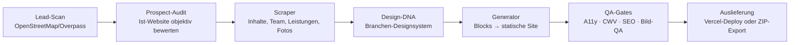

# Website-Builder

Automatisierte Pipeline, die für lokale Unternehmen (Kanzleien, Praxen, Studios, Gastronomie) komplette, produktionsreife Websites erzeugt — von der Lead-Recherche über Scraping und Design-System bis zu QA, Deploy und Auslieferung. Node.js, ohne Framework-Abhängigkeiten im Output: generiert wird reines statisches HTML/CSS mit sauberem SEO, Schema.org und Barrierefreiheit.

> Hinweis: Alle Firmen-, Personen- und Adressdaten in Tests und Beispielen sind fiktiv.

## Was die Pipeline kann



1. **Lead-Recherche** (`agent-leads.js`, `lead-scoring.js`, `places-lead-check.js`) — findet Unternehmen einer Branche über Overpass/OSM, gleicht sie mit Google Places ab und bewertet deterministisch, ob überhaupt Bedarf besteht (`prospect-audit.js`: nur ansprechen, wenn die Ist-Website objektiv schwach ist).
2. **Scraping & Inventur** (`agent-scraper.js`, `site-inventory.js`) — extrahiert Inhalte, Leistungen, Team-Profile und Fotos der Bestandsseite, inkl. Rollen-Präfix-Erkennung und Profil-Link-Auflösung.
3. **Design-System** (`design-dna.js`, `premium-rules.js`, `ui-intelligence.js`, `brand-assets.js`) — wählt pro Branche eine Design-DNA (Typografie, Farbwelt, Layout-Rhythmus) und kodifizierte Premium-Regeln statt Template-Optik.
4. **Generierung** (`generator.js`, `blocks/`, `pages.js`, `subpage-schema.js`, `faq.js`, `legal.js`) — baut Mehrseiten-Sites aus Blöcken: Leistungs-Detailseiten, Team, FAQ mit JSON-LD, Anfahrt, Impressum/Datenschutz.
5. **Asset-Pipeline** (`assets-*.js`, `fonts-build.js`, `images-build.js`, `vendor-build.js`, `weak-images.js`) — selbstgehostete Fonts mit Subsetting, responsive Bilder über `sharp`, Icon-Sets, Lizenz-Tracking (`licenses.js`).
6. **QA-Gates** (`a11y.js`, `cwv.js`, `image-qa.js`, `qa-agent.js`, `polish.js`, `comparison.js`) — automatische Prüfungen für Barrierefreiheit, Core Web Vitals, Bildqualität und Vorher/Nachher-Vergleich gegen die Bestandsseite.
7. **SEO & GEO** (`seo.js`, `geo.js`, `person-schema.js`) — Entity-SEO, LocalBusiness/Person-Schema, `llms.txt`, Sitemap, GEO-Report für KI-Suche.
8. **Auslieferung** (`deploy.js`, `export-zip.js`, `self-hosting.js`) — Ein-Klick-Deploy (Vercel) oder ZIP-Paket für klassisches Shared Hosting (inkl. `.htaccess`), mit gehärtetem Deploy-Ignore.
9. **Betrieb** (`server.js`, `analytics.js`, `tickets.js`, `agent-notion.js`, `pipeline-sync.js`) — Express-Dashboard für den gesamten Ablauf, Privacy-freundliche Analytics, Ticket-Benachrichtigungen und Lead-Sync nach Notion bzw. in eine Markdown-Pipeline.
10. **LLM-Integration** (`claude-cli.js`) — Text-/Content-Schritte laufen über die Claude-CLI mit Retry-Logik für transiente Fehler; alles andere ist deterministisch und LLM-frei.

## Tests

54 Test-Suiten (~400 Testfälle) mit dem eingebauten Node-Testrunner — ohne Netz, mit injizierten Abhängigkeiten:

```bash
npm test
```

Abgedeckt sind u. a. Lead-Scoring, Scraper-Parsing, Blocks/Dedup, JSON-LD-Escaping, XSS in Anfrage-Formularen, Deploy-Ignore, ZIP-Export, A11y-/GEO-/Scrape-Reports und die Pipeline-Synchronisation.

## Setup

Voraussetzungen: Node ≥ 20.

```bash
npm ci
cp .env.example .env   # Keys eintragen (alle optional, je nach Feature)
npm start              # Dashboard auf http://localhost:3000
```

| Env-Variable | Wofür |
|---|---|
| `CLAUDE_CODE_OAUTH_TOKEN` | Content-Generierung über die Claude-CLI |
| `GOOGLE_PLACES_API_KEY` | Lead-Abgleich mit Google Places |
| `NOTION_TOKEN` / `NOTION_DB_ID` | Lead-Sync nach Notion (optional) |
| `VERCEL_TOKEN` | Ein-Klick-Deploy (optional, sonst `vercel login`) |
| `SMTP_*` | Ticket-Benachrichtigungen (optional) |

## Struktur

```
├── server.js            Express-Dashboard + API
├── agent-*.js           Leads, Scraper, Visuals, Sales, Notion
├── design-dna.js        Branchen-Designsysteme
├── generator.js         Orchestrierung der Site-Generierung
├── blocks/ · pages.js   Seiten-Blöcke und Unterseiten
├── assets-*.js          Fonts, Icons, Fotos, Hero
├── a11y.js · cwv.js …   QA-Gates
├── seo.js · geo.js      SEO/GEO inkl. Schema.org & llms.txt
├── deploy.js            Vercel-Deploy · export-zip.js ZIP-Auslieferung
└── test/                54 Suiten, node:test
```
